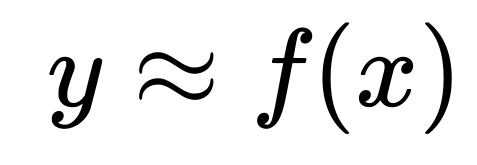

```{r setup, include=FALSE}
options(htmltools.dir.version = FALSE)

link <- function(href, ...) {
  htmltools::a(
    href = href,
    target = "_blank",
    ...
  )
}

library(ggplot2)
library(magrittr)
library(knitr)
library(tidyverse)
library(ISLR)
library(kableExtra)
theme_set(theme_minimal(14))
options(htmltools.dir.version = FALSE)

knitr::opts_chunk$set(
  echo = FALSE, 
  message = FALSE, 
  warning = FALSE,
  fig.width=6, 
  fig.height=6,
  fig.align='center'
)
library(rpart)
adv <- read_csv("static/data/Advertising.csv") %>%
  rename(vendas = sales)
```

class: middle, center

# Aprendizado supervisionado vs Não supervisionado

---

## Machine Learning

</img>

.footnote[
 fonte: [business2community](https://www.business2community.com/trends-news/10-companies-using-machine-learning-cool-ways-01889944)
]

---

## Aprendizado supervisionado

<br>

```{r, echo = FALSE, out.width="50%", fig.align="center"}
knitr::include_graphics("https://d33wubrfki0l68.cloudfront.net/295643c6243701ae6a9bac3fb8ad467ff0ce3c84/d1785/img/logo/cursor1-41.png")
```

<br>
<br>

```{r, echo = FALSE, out.width="40%", fig.align="center"}
knitr::include_graphics("img/logo_r6.png")
```

---

# Motivação


Somos consultores e fomos contratados para dar conselhos para uma empresa aumentar as suas vendas.

Obtivemos o seguinte banco de dados

```{r, fig.width = 10, fig.height = 4}
adv_ok <- adv %>% 
  gather(midia, investimento, -vendas)

adv_ok %>% 
  ggplot(aes(x = investimento, y = vendas)) + 
  geom_point() +
  geom_smooth(se = FALSE) +
  facet_wrap(~midia, scales = "free")
```

* PERGUNTA: Quantas vendas terão se eu investir X? Em qual mídia eu escolho alocar meu orçamento?


---

# Motivação - outro exemplo


Somos da área de inadimplência e precisamos agir para assessorar clientes em situação iminente de atraso.

Obtivemos o seguinte banco de dados

```{r, fig.width = 10, fig.height = 4}
set.seed(1)
inadimplencia <- tibble::tibble(
  tipo_de_contrato = rep(c("revol", "padrao", "price"), each = 1000),
  valor_da_parcela = round(runif(3000, min = 500, max = 3000), digits = 0),
  atrasou = rbinom(3000, 1, prob = 1/(1 + exp(-1*(
    -9 + 
      1.5 * (tipo_de_contrato == "revol") + 
      -1.5 * (tipo_de_contrato == "padrao") + 
      0.005 * (valor_da_parcela) + 
      1 * (valor_da_parcela > 1500)
    ))))
)
inad_curva <- inadimplencia %>% 
  ggplot(aes(x = valor_da_parcela, y = atrasou))  +
  facet_wrap(~tipo_de_contrato, scales = "free") +
  xlim(c(400, 3100))
inad_curva + 
  geom_point()
```

* PERGUNTA: Qual a probabilidade do contrato 123 atrasar a próxima fatura no mês que vem?

---

# Motivação - outro exemplo


Somos da área de inadimplência e precisamos agir para assessorar clientes em situação iminente de atraso.

Obtivemos o seguinte banco de dados

```{r, fig.width = 10, fig.height = 4}
inad_curva + 
  geom_point() +
  geom_smooth(se = FALSE, method = "glm", method.args = list(family = "binomial"))
```

* PERGUNTA: Qual a probabilidade do contrato 123 atrasar a próxima fatura no mês que vem?

---

# Motivação - outro exemplo


Somos da área de inadimplência e precisamos agir para assessorar clientes em situação iminente de atraso.

Obtivemos o seguinte banco de dados

```{r, fig.width = 10, fig.height = 4}
inad_curva +
  stat_summary_bin(size = 1, alpha = 0.1, colour = "white", bins = 7, geom = "bar", fill = "royalblue", fun = function(x) 1) +
  stat_summary_bin(size = 1, alpha = 0.1, colour = "white", bins = 7, geom = "bar", fill = "red") +
  stat_summary_bin(size = 2, alpha = 1, colour = "purple", bins = 7, geom = "point") + 
  geom_point() +
  geom_smooth(se = FALSE, method = "glm", method.args = list(family = "binomial"))
```

* PERGUNTA: Qual a probabilidade do contrato 123 atrasar a próxima fatura no mês que vem?

---

# Motivação - outro exemplo


Somos da área de inadimplência e precisamos agir para assessorar clientes em situação iminente de atraso.

Obtivemos o seguinte banco de dados

```{r, fig.width = 10, fig.height = 4}
inad_curva +
  stat_summary_bin(size = 1, alpha = 0.1, colour = "white", bins = 12, geom = "bar", fill = "royalblue", fun = function(x) 1) +
  stat_summary_bin(size = 1, alpha = 0.1, colour = "white", bins = 12, geom = "bar", fill = "red") +
  stat_summary_bin(size = 2, alpha = 1, colour = "purple", bins = 12, geom = "point")+ 
  geom_point() +
  geom_smooth(se = FALSE, method = "glm", method.args = list(family = "binomial"))
```

* PERGUNTA: Qual a probabilidade do contrato 123 atrasar a próxima fatura no mês que vem?


---

# Motivação - outro exemplo


Somos da área de inadimplência e precisamos agir para assessorar clientes em situação iminente de atraso.

Obtivemos o seguinte banco de dados

```{r, fig.width = 10, fig.height = 4}
inad_curva +
  stat_summary_bin(size = 1, alpha = 0.1, colour = "white", bins = 100, geom = "bar", fill = "royalblue", fun = function(x) 1) +
  stat_summary_bin(size = 1, alpha = 0.1, colour = "white", bins = 100, geom = "bar", fill = "red") +
  stat_summary_bin(size = 2, alpha = 1, colour = "purple", bins = 100, geom = "point")+ 
  geom_point() +
  geom_smooth(se = FALSE, method = "glm", method.args = list(family = "binomial"))
```

* PERGUNTA: Qual a probabilidade do contrato 123 atrasar a próxima fatura no mês que vem?

---

# Motivação - outro exemplo


Somos da área de inadimplência e precisamos agir para assessorar clientes em situação iminente de atraso.

Obtivemos o seguinte banco de dados

```{r, fig.width = 10, fig.height = 4}
inad_curva +
  stat_summary_bin(size = 1, alpha = 0.1, colour = "white", bins = 1000, geom = "bar", fill = "royalblue", fun = function(x) 1) +
  stat_summary_bin(size = 1, alpha = 0.1, colour = "white", bins = 1000, geom = "bar", fill = "red") +
  stat_summary_bin(size = 2, alpha = 1, colour = "purple", bins = 1000, geom = "point")+ 
  geom_point() +
  geom_smooth(se = FALSE, method = "glm", method.args = list(family = "binomial"))
```

* PERGUNTA: Qual a probabilidade do contrato 123 atrasar a próxima fatura no mês que vem?


---

# Machine Learning 

Matematicamente, queremos encontrar uma função $f()$ tal que:



<br/>
<br/>
<br/>
<br/>
<br/>
<br/>
<br/>

Nos exemplos:

$vendas = f(midia, investimento)$

$inadimplência = f(valor da parcela, tipo de contrato)$


---

# Modo - Regressão e Classificação

Existem dois principais tipos de problemas em Machine Learning:

.pull-left[

## Regressão

__Y__ é uma variável contínua.

- Volume de vendas
- Peso
- Temperatura
- Valor de Ações

]

.pull-right[

## Classificação

__Y__ é uma variável categórica.

- Fraude/Não Fraude
- Pegou em dia/Não pagou
- Cancelou assinatura/Não cancelou
- Gato/Cachorro/Cavalo/Outro

]


---

# Modelagem não supervisionada

A principal diferença é não termos $X_1, X_2, \dots$ e $Y_1, Y_2, \dots$. Não temos nenhum $Y$, então nossos algoritmos vão procurar encontrar _coisas interessantes_ sobre $X_1, X_2, ..., X_p$. Aqui vale _praticamente_ tudo, podemos responder perguntas como:

- Tem algum jeito informativo de visualizar os dados?
- Podemos descobrir subgrupos dentre as variáveis?
- As variáveis são parecidas a ponto de podermos representa-las em dimensão menor?

Como se pode notar, modelagem não supervisionada pode ser mais subjetiva e frequentemente é parte de uma análise exploratória.

---

# Modelagem não supervisionada

De maneira geral existem três problemas principais que os métodos de modelagem supervisionada se propõe a resolver:

- Clusterização
- Redução de dimensionalidade
- Detecção de anomalias

Por outro ponto de vista, também é comum que se use os _outputs_ ou parte desses algoritmos como parte de um modelo supervisionado. Por exemplo: 

$$X_1, ..., X_p \rightarrow \text{grupos} \rightarrow Y_i = \text{grupo}_i$$

---

## Clusterização | Iris

Exemplos clássico: banco de dados `iris`:

```{r}
knitr::include_graphics("http://1.bp.blogspot.com/-T2GENttCVWs/U3UZN7PfepI/AAAAAAAAAAU/mJDRhnhmNL4/s1600/3-b8bbc465fa.jpg")
```

Existem espécies de plantas que influenciam essas características biológicas.

---

## Clusterização | Iris

```{r}
ggplot(iris, aes(Petal.Length, Petal.Width)) +
  geom_point(size=4)
```

---

## Clusterização | Iris

.pull-left[

```{r, echo = TRUE, eval = FALSE}

iris |> 
  select(-Species) |> 
  kmeans(centers = 3) |> 
  augment(iris) |> 
  ggplot() +
  aes(
    Petal.Length,
    Petal.Width)
  geom_point(
    aes(color = .cluster),
    size=4)
```

]

.pull-right[

```{r,  fig.width = 10, fig.height = 8}
set.seed(1107195)

library(tidymodels)

iris_sem_na <- drop_na(iris)

grupos <- kmeans(select(iris_sem_na, -Species), centers = 3)

dados_com_grupo <- augment(grupos, iris_sem_na)

ggplot(dados_com_grupo, aes(Petal.Length, Petal.Width)) +
  geom_point(aes(color = .cluster),size=4) 
```
]
---

## Clusterização | Iris | Grupos reais

```{r,  fig.width = 10, fig.height = 5}
library(tidymodels)
library(patchwork)

iris_sem_na <- drop_na(iris)

grupos <- kmeans(select(iris_sem_na, -Species), centers = 3)

dados_com_grupo <- augment(grupos, iris_sem_na)

(ggplot(dados_com_grupo, aes(Petal.Length, Petal.Width)) +
  geom_point(aes(color = .cluster),size=4) +
  ggtitle("Cluster inferido"))+
(ggplot(dados_com_grupo, aes(Petal.Length, Petal.Width)) +
  geom_point(aes(color = Species),size=4)+
   ggtitle("Espécie real"))
```

---

## Consequências de um modelo supervisionado

No caso do iris, podemos usar os _outputs_ da clusterização de vários jeitos:

- Pontos em que o cluster e a espécie discordam para identificar pontos suspeitos.
- Usar só o grupo 1.
- No caso de não conhecer as espécies verdadeiras, usar os grupos em um modelo supervisionado posterior.

---
