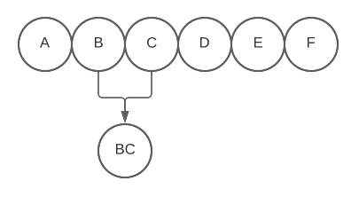
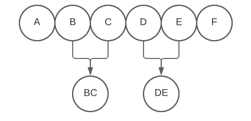
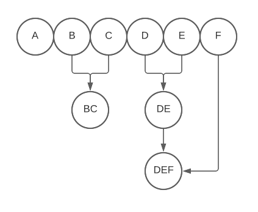
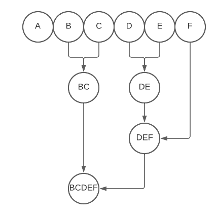
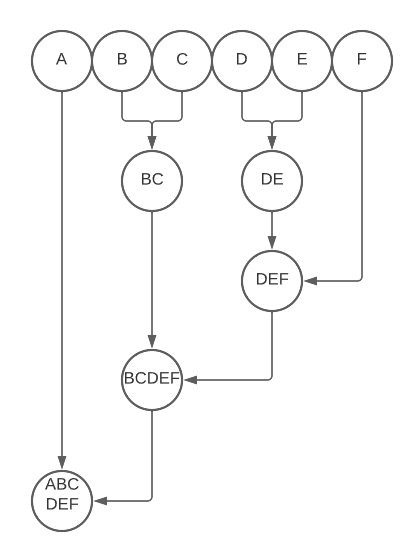
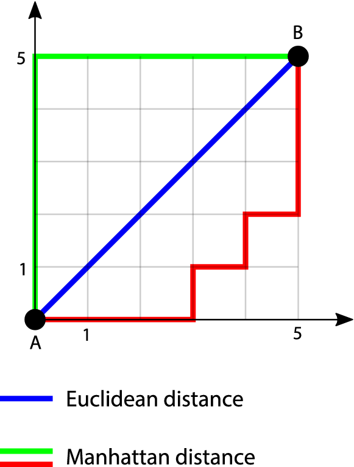
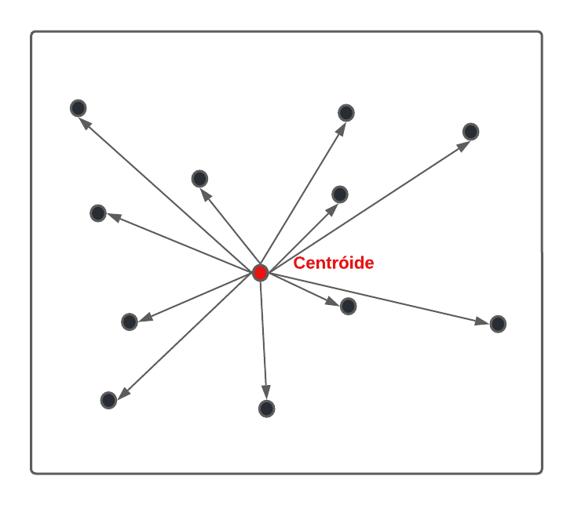

```{r setup, include=FALSE}
options(htmltools.dir.version = FALSE)

link <- function(href, ...) {
  htmltools::a(
    href = href,
    target = "_blank",
    ...
  )
}

library(ggplot2)
library(magrittr)
library(knitr)
library(tidyverse)
library(ISLR)
library(kableExtra)
theme_set(theme_minimal(14))
options(htmltools.dir.version = FALSE)

knitr::opts_chunk$set(
  echo = FALSE, 
  message = FALSE, 
  warning = FALSE,
  fig.width=6, 
  fig.height=6,
  fig.align='center'
)
library(rpart)
adv <- read_csv("static/data/Advertising.csv") %>%
  rename(vendas = sales)
```

class: middle, center

# Modelos de clusterização

---

## Introdução

Um modelo de clusterização presume que existem grupos escondidos (ou latentes) dando origem aos dados observados. 

Um **algoritmo** de clusterização é uma estratégia para encontrar esses grupos. As vezes a gente sabe que existem grupos (modelo) mas o **algoritmo** não é capaz de encontrar. 

```{r}
knitr::include_graphics("https://www.researchgate.net/profile/Absalom-Ezugwu/publication/344590665/figure/fig1/AS:945789706702848@1602505246144/Clustering-example-with-intra-and-inter-clustering-illustrations.png")
```

---

## Estratégias de clusterização

Os principais algoritmos podem ser separados de acordo com algumas estratégias principais:

- Métodos hierárquicos:

    - Vai agrupando as observações mais próximas até que comece a aparecer uniões de elementos diferentes demais.
    
- Métodos baseados em centróides

    - Procura os melhores centros de massa dentro de cada nuvem de pontos
- Métodos baseados em distribuições

    - Procura grupos de acordo com hipóteses sobre a distribuição dos dados

---

## Clustering hierárquico

A ideia principal por trás do clustering hierárquico é construir grupos a partir de uma noção de distância entre pontos.

Uma distância que aparece em mapas, telas, na geometria etc é a distância euclidiana:

$$D((x_1,y_1),(x_2,y_2)) = \sqrt{(x_1-x_2)^2+(y_1-y_2)^2}$$

```{r}
knitr::include_graphics("https://www.tutorialexample.com/wp-content/uploads/2020/05/Euclidean-distance-in-tensorflow.png")
```

---

## Medidas de distância

Embora a distância euclidiana tenha uma interpretação física, ela serve para comparar linhas de tabelas arbitrárias se você quiser:

Pontos próximos:

$$\text{Distância }: 0,5477$$

```{r}
iris[1,] |> 
  tibble::as.tibble() |> 
  knitr::kable()
```

<br>

```{r}
iris[17,] |> 
  tibble::as.tibble() |> 
  knitr::kable()
```

---

## Medidas de distância

Embora a distância euclidiana tenha uma interpretação física, ela serve para comparar linhas de tabelas arbitrárias se você quiser:

Pontos distantes:

$$\text{Distância }: 6,4984$$

```{r}
iris[1,] |> 
  tibble::as.tibble() |> 
  knitr::kable()
```

<br>

```{r}
iris[119,] |> 
  tibble::as.tibble() |> 
  knitr::kable()
```

---

## Medidas de distância

Existem outras medidas de distância, mas não precisamos pensar nelas agora. Vamos prosseguir identificando o que um clustering hierárquico faz a partir de uma noção de distância.

O que entra em um algoritmo de clusterização hierárquica é o que é usualmente chamado de **matriz de distâncias**:

```{r}
iris[1:3,] |> 
  tibble::rownames_to_column(var = "identificador") |> 
  knitr::kable()
```

<br>

```{r}
iris[1:3,] |> 
  dist() |> 
  as.matrix() |> 
  as.tibble() |> 
  tibble::rownames_to_column(var = "identificador") |> 
  knitr::kable()
```

---

## Dendrograma

- O próximo passo é construir um mapeamento de quais pontos estão próximos e quais não estão. Isso é feito usando um dendrograma (dendro = árvore). O dendrograma pode ser executado seguindo os passos:

**Passo 1**: Calcule as distâncias entre os pontos:

```{r}
knitr::include_graphics("https://upload.wikimedia.org/wikipedia/commons/thumb/b/b5/Clusters.svg/250px-Clusters.svg.png")
```

---

## Dendrograma

**Passo 2**: Una os pontos mais próximos:

```{r}

```

---

## Dendrograma

**Passo 3**: Una os próximos pontos mais próximos:

```{r}

```

---

## Dendrograma

**Passo 4**: A união de dois pontos conta como um novo ponto e a distância até um ponto e esse agrupamento pode ser, por exemplo a distância média ao membros:

```{r}

```

---

## Dendrograma

.pull-left[**Passo 5**: A mesma lógica se aplica a conjuntos com mais do que 2 pontos: compara-se, por exemplo, média com média.
]

.pull-right[
```{r}

```
]

---

## Dendrograma

.pull-left[

**Passo 6**: O dendrogama está completo quando todas os elementos estão contemplados e pertencem a algum grau de agrupamento.

]


.pull-right[
```{r}

```
]
---

## Dendrograma | dataset iris

Aqui temos um exemplo de dendrograma gerado usando a distância euclidiana em 12 linhas do dataset iris (4 por espécie).

```{r}
library(ggdendro)

iris |> 
  group_by(Species) |> 
  dplyr::sample_n(4) |> 
  ungroup() |> 
  select(-Species) |> 
  dist() |> 
  hclust() |> 
  ggdendrogram() + 
  coord_flip()
```

---

## Dendrograma | dataset iris

Podemos cortar onde quisermos e obter qualquer número de grupos que desejarmos dentro do dendrograma. Sendo assim podemos interpretar o ato de construir um dendrogama e construir qualquer número $k$ de grupos como uma técnica descritiva.

.pull-left[

```{r}
aux <- iris |> 
  group_by(Species) |> 
  dplyr::sample_n(20) |> 
  ungroup() |> 
  select(-Species) 

dendro <- aux |> 
  dist() |> 
  hclust() 

plot(dendro)

dendro |> 
  rect.hclust(k = 3, border = "blue")
```

]

.pull-right[

```{r}
aux <- iris |> 
  group_by(Species) |> 
  dplyr::sample_n(10) |> 
  ungroup() |> 
  select(-Species) 

dendro <- aux |> 
  dist() |> 
  hclust() 

plot(dendro)

dendro |> 
  rect.hclust(k = 2, border = "blue")
```

]
---

## Dendrograma | dataset iris

Um jeito mais objetivo de escolher o número de grupos é olhando o tamanho dos saltos na coluna de distância. Uma estratégia tecnicamente viável é parar de cortar quando no maior salto possível entre um grupo e outro. No caso do `iris` isso acontece no segundo grupo. A distância entre os grupos não aumentaria indo do segundo para o terceiro grupo.

```{r}
dendro <- iris[,-5] |> 
  dist() |> 
  hclust() 

barplot(dendro$height[(nrow(iris)-10):(nrow(iris)-1)],
  names.arg = 10:1 # show the number of cluster below each bars
)
```

---

## Dendrograma | dataset iris

Mas nós temos 3 espécies né? O que pode ter acontecido?

Aqui entra um fato importante: estamos estudando um **algoritmo** de clusterização. Existindo grupos por trás ou não, ele vai devolver algum resultado. Por isso é importante alterar as configurações dos algoritmos de clusterização para verificar se nossos resultados são sensíveis a elas ou não. Nos algoritmos hierárquicos as principais fontes de variação são:

- a métrica de **distância utilizada**
- a **regra para calcular a distância entre dois grupos** de pontos. É a média das distâncias? É a mediana? É a maior distância de um ponto a qualquer elemento de um grupo etc.

---

## Distâncias | Distância de Manhattan

.pull-left[

  Essa distância também é conhecida como "distância do taxista" pois os segmentos que constituem o seu compromimento só podem ser verticais ou horizontais.
  
  Matematicamente, essa noção pode ser descrita como:
  
  $$d((x_1,y_1), (x_2,y_2)) = |x_1-x_2|+|y_1-y_2|$$

]

.pull-right[
```{r, out.width="100%"}

```
]
---

## Dendrograma | dataset iris

Se mudássemos a noção de distância para a distância de Manhattan encontraríamos outro resultado: 

```{r, out.width="50%"}
aux <- iris |> 
  group_by(Species) |> 
  #dplyr::sample_n(30) |> 
  #ungroup() |> 
  select(-Species) 

dendro <- hclust(dist(aux, method = "manhattan"))

barplot(dendro$height[(nrow(aux)-10):(nrow(aux)-1)],
  names.arg = 10:1 # show the number of cluster below each bars
)
```

Três grupos! Como é segundo o conhecimento biológico sobre esses dados.

---

## Métodos de centróides

A clusterização hierárquica parte das observações e aglomera até que os clusters surjam naturalmente. 

Clusterização baseada em centróides, por outro lado, normalmente são métodos iterativos que procuram os melhores "pontos de referência" para cada cluster. O número de clusters deve ser fixado no começo do algoritmo e então os "pontos de referência" (centróides) são atualizados até encontrar grupos tão diferentes quanto possível. 

Por essa dinâmica, um dos métodos baseados em centróides mais famoso é o método das $k$-médias.

---

## Como o k-means funciona?

```{r, out.width="65%"}
knitr::include_graphics("https://upload.wikimedia.org/wikipedia/commons/thumb/e/ea/K-means_convergence.gif/617px-K-means_convergence.gif?20170530143526")
```

---

## O que o método das k-médias está realmente fazendo?

Para montar a imagem agradável que vimos no slide anterior o algoritmo se preocupa em construir centróides que estejam o mais próximos o possível dos pontos em sua "órbita" (ou cluster).

Vamos ter várias estratégias para medir essa variabilidade, mas uma razoável e que será usada o k-means é aplicar a seguinte fórmula. Vamos dizer que $c$ seja o centróide e $x_1$, ... $x_n$ os pontos de um cluster.

Podemos medir o quão dispersos esses pontos estão com relação ao centróide somando todas as distâncias:

$$SSW = \sum_{i=1}^n d(c, x_i) = \sum_{i=1}^n ||c-x_i||^2$$
---

## Como medir a variabilidade dentro de cada grupo?

```{r}

```

---

## Como o k-means funciona? (revisitado)

1. Primeiro escolhemos os clusters para começar. Normalmente isso é feito por sorteio.

2. Depois para cada ponto encontramos o cluster ao qual aquele ponto pertence (centróide mais próximo)

3. Os centróides atuais provavelmente não vão ser os melhores possíveis dentro de cada cluster. Vamos atualizar os centróides sendo aqueles que minimizam a $SSW$ de cada cluster.

4. Vamos repetir o passo 2. e em seguida o 4. várias vezes até chegar a uma condição de parada. Ou a soma dos $SSW$ não está sofrendo alterações significativas em uma atualização ou chegamos ao número máximo de iterações.

---

## SSW

Do ponto de vista teórico, o método das k-médias, por conta do vai e vem dos passos 2. e 3. do slide anterior garante que estamos melhorando a seguinte métrica de qualidade dos nossos clusters:

$$\text{Soma dos quadrados dos grupos} = \sum_{i=1}^k \sum_{\text{pontos no cluster i}} ||c_i-p||^2$$

Essa métrica, inclusive, pode ser usada para comparar o resultado do algoritmo com qualquer número de clusters.

Vamos ao R!

---

## O que pode dar errado?

Algumas coisas podem dar errado no k-means por conta da estratégia geral utilizada:

- A distância euclidiana simples pode não ser a melhor e, além disso, se as variáveis estiverem em escalas diferentes o resultado pode ser muito influenciado por uma delas.

    - Usar a distância euclidiana essencialmente consiste em particionar o um gráfico 2d de acordo com pontos de referência. Alguns clusters reais tem natureza diferente desses.
    
```{r}
knitr::include_graphics("https://i.stack.imgur.com/SlpL1.png")
```
    
---

# O que pode dar certo?

```{r}
knitr::include_graphics("https://i.stack.imgur.com/BILDt.png")
```

---

# O que pode dar certo?

```{r}
knitr::include_graphics("https://i.stack.imgur.com/vBuTf.png")
```


---
